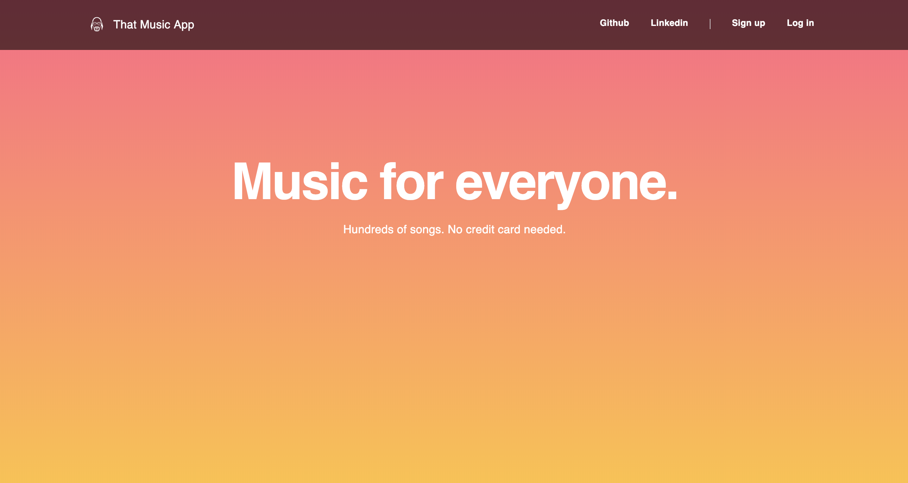

# That Music App

[Live](https://that-music-app.herokuapp.com/#/)

## Overview

That Music App is a fullstack clone of Spotify that allows you to stream songs whenever you want. Browse your favorite artists and albums, and create your very own playlist!

## Technologies

#### Front-End
* React.js
* Redux

#### Back-End
* Ruby on Rails
* PostgreSQL
* AWS S3

## Key Features

#### Recently Played
If you ever want to go back to a playlist, album, or an artist page, That Music App makes it very easy for you to do that. That Music App stores every playlist, artist, and album page you've visited. Want to listen to *that song* again? That Music App got you covered. :)

#### Search
As you search the songs, That Music App renders the results with each keystroke. There is no need for a "search" button.

#### Responsive Design
That Music App renders nicely on smaller devices, like iPad and other tablet devices.

#### Playbar
The Playbar will play the songs no matter where you are on That Music App. The progress bar makes it very easy for you to skip songs, shuffle the song queue, and repeat that song you're particularly obsessed with.

And, no matter when you log back into That Music App, it will always remember that last song you played.

## Future Plans
* Allow users to change their playlist title, and add a cover image of their choice.
* Create a page for each users so they can follow each other.
